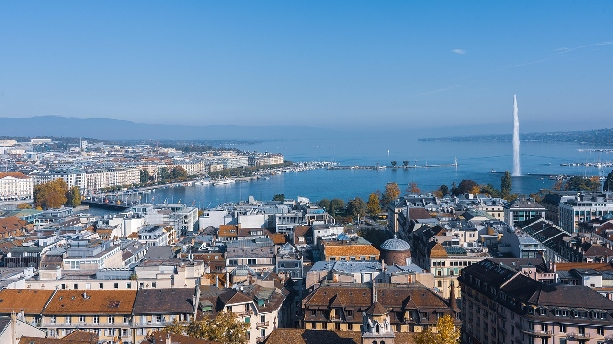

# Accueil: Documentation pré-processing du Panel Lémanique

Initié par la faculté ENAC de l'EPFL, le Panel Lémanique est une étude lancée en 2021 pour une durée de 5 ans. Il a pour but de mesurer l’évolution des comportements, des usages et des opinions sur des modes de vie à la manière d’un observatoire. Il aborde entre autres les thématiques de la mobilité (quotidienne et à fins récréatives), du logement, du télétravail et de la consommation énergétique.

Le Panel Lémanique couvre l’entièreté du territoire des cantons de Vaud et de Genève. Il s’étend également dans le périmètre du Grand Genève, couvrant ainsi une partie des départements français de l’Ain et de Haute-Savoie. Enfin, il couvre également une partie du Chablais valaisan et les régions de la Broye et de Gruyère dans le canton de Fribourg.

Le Panel Lémanique est composé de plusieurs vagues. Au total, cinq vagues comparatives vont avoir lieu entre 2022 et 2026 (trois sur la mobilité et deux sur les habitudes de consommation et le logement). De plus, des vagues uniques sont menées, autant sur l'ensemble du périmètre (vague PDCn, vague Rythme et Insécurité) que sur des parties du périmètre (vagues loisirs estivaux et hivernaux).

Les données de ces vagues ont été récoltées par FORS, le centre de compétences suisse en sciences sociales, puis traitées par le LaSUR. Elles sont aujourd'hui mises à disposition pour la recherche ainsi que les partenaires.

Ce site a pour vocation de documenter le traitement des données effectué au LaSUR avant de les publier sur OPAL.
